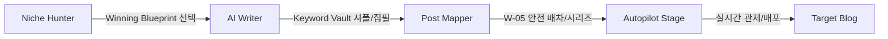

# MAZA STORY v2 (Maza Autopilot OS) - AGENTS.md v8.3
> **"모든 기능은 애드센스 승인과 수익화라는 결과에 기여해야 한다."**
> 이 문서는 정책 선언이자 구현 계약서다. 선언과 코드는 반드시 일치해야 한다.
> 프로젝트의 중심은 '도전'을 넘어 '완전 자동화(Autopilot)'로 진화한다.

---

## 1. 북극성 지표 (The North Star)

| 항목 | 기준 |
|------|------|
| **최종 목표** | 유저의 애드센스 승인 및 지속 수익화 |
| **핵심 워크플로우** | **Niche Hunter** → **AI Writer** → **Post Mapper** (One Engine) |
| **운영 철학** | **Zero-Jump**: 모든 관제는 Autopilot Stage에서 원스톱으로 이루어진다. |

---

## 2. 핵심 설계 철학 (Autopilot OS)

1.  **원 엔진(One Engine) 파이프라인**: [주제 발굴] - [집필] - [배차]를 하나의 유기적인 흐름으로 통합한다.
2.  **키워드 금고(Keyword Vault) 우선**: 외부 API 호출 최소화를 위해 사전에 발췌된 고수익 키워드 금고를 우선 활용한다.
3.  **안전 제일(W-05 Protocol)**: 계정 보호를 위해 모든 자동 발행은 최소 3시간의 간격을 강제한다. (W-05 규약)
4.  **주제 권위(Topical Authority)**: 단발성 글이 아닌 '시리즈(Series)' 형태의 묶음 발행을 통해 검색 엔진의 신뢰를 확보한다.
5.  **제로-점프(Zero-Jump) 관제**: 유저는 페이지를 이동할 필요 없이 `Autopilot Stage`에서 모든 자동화 현황을 모니터링한다.
6.  **경험 우선(Experience-First)**: AI 생성 이미지를 넘어 유저의 실제 사진(iPhone/Android)을 활용한 독창적 콘텐츠 생성을 최우선한다.

---

## 3. 통합 자동화 워크플로우 (MANDATORY)

모든 자동화 프로세스는 아래의 **'원 엔진'** 흐름을 반드시 따른다:



---

## 4. 에이전트 아키텍처 (One Engine Framework)

### Layer 1: Strategy (Niche Hunter Agent)
| Agent | 역할 | 자산 (Assets) |
|-------|------|--------------|
| **BlueprintAgent** | 승인/수익률이 검증된 20+개의 정답지 제공 | `Winning Blueprint Library` |
| **VaultManagerAgent** | 각 전략별 고수익 키워드 풀(Pool) 관리 | `Keyword Vault (API-Free)` |

### Layer 2: Production (AI Writer Engine)
| Agent | 역할 | 특징 |
|-------|------|------|
| **StreamingWriterAgent** | 5단계(분석-목차-본문-이미지-SEO) 실시간 집필 | 고품질 E-E-A-T 텍스트 생성 |
| **ShuffleEngineAgent** | 키워드 금고에서 최적의 주제 무작위 추출 | 초고속 집필 모드 (API 절약) |
| **VisionWriterAgent** | 유저 사진 분석 및 스토리텔링 결합 | **Experience Mode (E-01)** |

### Layer 3: Distribution (Post Mapper Agent)
| Agent | 역할 | 규약 (Protocol) |
|-------|------|----------------|
| **SeriesSchedulerAgent** | 키워드 나열 기반 시리즈/배치 예약 | `Sequential Batch Scheduling` |
| **SafetyGuardAgent** | 3시간 발행 간격 및 계정 상태 모니터링 | `W-05 Safety Protocol` |

### Layer 4: Orchestration (Autopilot Stage)
| Agent | 역할 | 모니터링 항목 |
|-------|------|--------------|
| **StageControlAgent** | 전역 하단 UI를 통한 전체 엔진 관제 | 진행률, 쿨타임, 시리즈 현황 |

---

## 5. Validation Scoring Rule (100점제)

> **구현 위치**: `server/lib/validator.ts`

| 항목 | 배점 | 측정 방법 |
|------|:----:|----------|
| 제목에 키워드 포함 | 20점 | `# 제목`에서 키워드 매칭 |
| 본문 1,500자 이상 | 20점 | 공백 제외 텍스트 길이 |
| H2/H3 태그 2개 이상 | 15점 | `##`, `###` heading 카운트 |
| 이미지 1개 이상 | 15점 | `` 또는 `` 태그 |
| 내부 링크 포함 | 10점 | 같은 도메인 링크 또는 내부 앵커 |
| 메타 디스크립션 권장 | 10점 | 글 첫 문단 150자 이내 요약 존재 |
| YMYL 리스크 없음 | 10점 | 고위험 키워드 3개 미만 |

---

## 6. W-05 Safety & Series Rules

> **구현 위치**: `src/components/PostMapper.tsx`

1.  **발행 간격**: 모든 자동화 발행은 직전 발행 건으로부터 **10,800초(3시간)** 이내에 중복 발행될 수 없다.
2.  **시리즈 우선**: 카테고리 전문성(Topic Authority) 확보를 위해 최소 3개 이상의 연관 키워드 시리즈 구성을 권장한다.
3.  **랜덤 셔플**: 키워드 금고 사용 시, 동일 패턴 반복을 피하기 위해 반드시 랜덤 셔플 엔진을 거쳐야 한다.

---

## 7. AI 파이프라인 및 운영 안정성

### Retry Strategy (구현 계약)
```
요청 진입
  └─ Primary 모델 시도 (gemini-3-flash-preview)
       ├─ 성공 → 결과 반환
       └─ 실패
            ├─ 429/503 → 지수 백오프 (1s→2s→4s→8s) + 다음 API Key 로테이션 (최대 10회)
            ├─ 404/403 → KI 기준 폴백 체인 순서대로 즉시 시도:
            │             gemini-3-flash-preview → gemini-2.5-flash → gemini-2.0-flash → gemini-2.5-pro → throw
            └─ 전체 실패 → 캐시 또는 에러 반환
```

### OpenRouter Free Assistant Worker & Key Rotation (v8.3 추가)
1. **서브 에이전트/자동 검수용 무료 비서**: 콘텐츠 생성 후 자가 진단 및 다중 검증(Cross-Verification)을 수행하기 위해 OpenRouter Free API를 활용하는 서브 에이전트 아키텍처를 적극 도입한다.
2. **API Key 쉼표(,) 구분 로테이션**: 오픈라우터 및 기타 AI API 키 등록 시, 다수의 계정 키를 쉼표(`,`)로 연결하여 입력할 수 있도록 지원한다. 시스템은 이를 배열로 쪼갠 뒤 라운드 로빈(Round-Robin) 방식으로 번갈아 호출하여 분당 요청 수(RPM) 제한과 쿼터 장벽을 안전하게 돌파한다.
3. **비상용 유료 키 결합 (하이브리드 로테이션)**: 무료 키들로 우선 로테이션을 돌리되, 모두 제한에 걸리거나 오류가 발생할 경우를 대비하여 소액 충전된 유료 마스터 API 키를 최종 백업(Fallback)으로 두는 하이브리드 아키텍처 구성을 적극 권장한다.

### 절대 사용 금지 모델 (2026-05-14 최종 확인)
| 모델명 | 사유 |
|--------|------|
| `gemini-3-flash-latest` | ❌ 폐기됨 (404) |
| `gemini-3.1-flash-lite-latest` | ❌ 존재하지 않는 모델명 |
| `gemini-3.1-pro-latest` | ❌ 존재하지 않는 모델명 |
| `gemini-1.5-flash` / `gemini-1.5-pro` | ❌ 폐기됨 (404) |

> 모델 변경 시 반드시 KI 참조: `/Users/m/.gemini/antigravity/knowledge/ai-model-registry/artifacts/model-registry.md`

---

## 8. KPI 목표값 (Success Metrics)

| 지표 | 목표 | 책임 컴포넌트 |
|------|:----:|-------------|
| Setup → 첫 글 생성 전환율 | **70%** | `Setup.tsx` (친절한 가이드) |
| 글 생성 → 발행 전환율 | **60%** | Validation Score UI |
| URL 검증 통과율 | **80%** | `VerificationAgent` |
| 애드센스 승인율 | **60%** | `AIWriter` 파이프라인 |
| 평균 승인 소요 기간 | **45일** | 전체 시스템 효율 |

---

## 9. 의사결정 매트릭스 (Decision Matrix)

| 충돌 상황 | 승리 | 패배 | 이유 |
|-----------|------|------|------|
| 품질 vs 비용 | 승인율 (Pro 모델) | 예산 절감 (Flash) | 승인율 하락은 존재 이유를 훼손 |
| 안전 vs 편의 | W-05 강제 | 완전 자유 발행 | 계정 보호가 최우선 |
| 보안 vs 속도 | Rate Limit 방어 | 응답 속도 | 과금 폭탄 방어가 먼저 |

---

## 10. UX/UI 원칙 (Autopilot Edition)

### 필수
- **Autopilot Stage**: 모든 페이지 하단에 고정되어 엔진의 상태를 보여줄 것.
- **Data Simulation**: 예상 수익 및 성장 곡선을 시각화하여 유저에게 강력한 수익화 동기를 부여할 것.
- **Micro-Interactions**: 집필 및 배차 시 애니메이션 피드백 필수.
- **Series Preview**: 시리즈 예약 시 전체 대기열을 시각화할 것.

### 절대 금지
- **Silent Failure**: 에러 발생 시 Stage UI에 즉시 경고 표시.
- **Manual Input Fatigue**: 과도한 텍스트 입력 요구 금지 (금고 활용).

---

## 11. 데이터베이스 및 보안

- **ms_events**: 모든 유저 행동(generate, publish, verify)은 정규화 로그로 남긴다.
- **API Key**: 서버 환경변수에서만 관리, 클라이언트 노출 절대 금지.
- **Node Environment**: Production 모드에서 엄격한 Rate Limit 적용.

---

## 12. 구현 로드맵 (Roadmap)

| 단계 | 항목 | 상태 |
|------|------|------|
| **Phase 1~3** | 기초 인프라 및 검증 엔진 구축 | ✅ 완료 |
| **Phase 4** | Autopilot OS 승격 (Hunter & Mapper 통합) | ✅ 완료 |
| **Phase 5** | Intelligence Update (Vault & Shuffle) | ✅ 완료 |
| **Phase 6** | Global Orchestration (Stage 실시간 연동) | ✅ 완료 |
| **Phase 7** | 외부 수익 블록 자동 삽입 및 제휴 최적화 | ✅ 완료 |
| **Phase 8** | AI 모델 레지스트리 전면 감사 — 폐기 모델 전수 제거, KI 기준 폴백 체인 재확정 | ✅ 완료 (2026-05-14) |
| **Phase 9** | Tiered Referral Program — 2단계 티어드 리퍼럴 시스템 및 파트너 대시보드 구축 | ✅ 완료 (2026-05-26) |

---

## 13. 프리미엄 렌더링 (Premium Rendering)

*   **RendererAgent**: SEO 최적화된 AdSense-Friendly HTML 생성.
*   **이미지 최적화**: Pexels API 및 **유저 경험 사진(E-01)** 기반 최적화 이미지 매칭.
*   **서식 복사**: Rich-Text 클립보드 데이터 제공으로 에디터 호환성 확보.

---

## 14. 프로젝트 변천사 (Project Evolution)

| 버전 | 일자 | 핵심 변화 (Milestones) | 철학적 변곡점 |
|:---:|:---:|---|---|
| **v1.0** | 초기 | 애드센스 챌린지 개념 도입 | '글쓰기'에서 '승인'으로 목표 정의 |
| **v2.0** | 안정 | Zero-IT 인프라 및 익스텐션 연동 | 유저의 기술적 허들 제거 |
| **v3.0** | 구조 | 4-Layer 에이전트 아키텍처 확립 | 시스템의 모듈화 및 역할 분담 |
| **v4.0** | 품질 | Validation Score (100점제) 도입 | '양'보다 '질' (SEO 수치화) |
| **v5.0** | 신뢰 | AI Retry & Fallback 프로토콜 | 24/7 운영 안정성 확보 |
| **v6.0** | 감동 | 프리미엄 렌더러 및 익스텐션 시너지 | 유저 경험(UX)의 완성 |
| **v7.0** | 도약 | Maza Autopilot OS 선포 | '도구'에서 '자율 주행 OS'로의 대전환 |
| **v8.0** | **신뢰** | **Experience-First Protocol (E-E-A-T)** | **'AI 생성'을 넘어 '경험 증명'으로 가치 혁신** |
| **v8.1** | **2026-05-14** | **AI 모델 레지스트리 전면 감사 완료** | **'존재하지 않는 모델'로 인한 생성 중단 원천 차단** |
| **v8.3** | **2026-05-19** | **오픈라우터 무료 비서단 연동 및 쉼표 구분 API 키 로테이션 확립** | **극단적 비용 절감 및 무중단 서브 에이전트 설계 기법 확보** |
| **v8.4** | **2026-05-26** | **애드센스 승인 최적화 다변화 엔진 적용** | **5종 템플릿 스위칭 및 순수 이미지 우선 정책 (자동화 감지 회피)** |
| **v8.5** | **2026-05-26** | **Tiered Referral Program 도입** | **2단계 파트너 네트워크를 통한 바이럴 성장 루프 구축** |

---

## 15. Tistory API Key-Free Policy (2026~)

> **주의**: 티스토리는 2024년부터 전통적인 Open API 키 발급 방식을 제한/폐지했습니다. 따라서 본 프로젝트는 2026년 현재까지 다음 원칙을 고수합니다.

1.  **API Key 사용 금지**: 서버 사이드 OAuth 및 Client ID 기반의 연동을 시도하거나 사용자에게 요구하지 않는다.
2.  **익스텐션 기반 주입 (Extension-Injection)**: 모든 포스팅 발행은 **MazaStudio Chrome Extension**을 통한 브라우저 세션 기반 주입 방식으로 수행한다.
3.  **RPA 워크플로우**: 서버는 콘텐츠를 생성하고 대기열(`ms_scheduled_posts`)에 적재하며, 익스텐션이 이를 감지하여 유저의 브라우저에서 티스토리 에디터에 직접 본문을 주입한다.
4.  **UI 가이드**: 설정 페이지에서 'API 연동' 대신 '익스텐션 연결 상태'를 우선적으로 표시한다.

---

## 16. Identity & Infrastructure Decoupling Policy (2026)

> **"사용자의 가입 계정과 블로그 인프라 운영 계정은 독립적으로 관리되어야 한다."**

1. **가입과 인프라의 분리**: 유저는 카카오, 네이버, 개인용 구글 계정 등 어떤 수단으로든 플랫폼에 가입할 수 있다. 
2. **애드센스 전용 부계정 지원**: 수익형 블로그 운영의 보안과 관리를 위해, 실제 구글 애드센스 및 서치콘솔/GA4 연동 시에는 가입 계정과 별개인 '수익 창출 전용 구글 계정'을 추가로 연결할 수 있도록 지원해야 한다.
3. **다중 계정 대응 UX**: 인프라 세팅(Setup) 단계에서 현재 연결된 구글 세션이 없거나 변경을 원할 경우, '전용 구글 계정 연결' 플로우를 명시적으로 제공하여 유저의 혼선을 방지한다.

---

## 17. Experience-First Protocol (E-01)

> **"구글은 AI의 지식보다 인간의 경험(Experience)을 더 신뢰한다."**

1. **사용자 사진 우선**: AI 생성 이미지보다 유저가 직접 촬영한 사진(iPhone/Android 등) 활용을 최우선 권장한다.
2. **iPhone Metadata Cleaning (P-01)**: 아이폰 등 모바일 사진 업로드 시, 개인정보 및 원본성 훼손 방지를 위해 모든 Exif 메타데이터를 서버 사이드에서 즉시 세탁(Scrubbing)해야 한다.
3. **Safe Device Authentication (P-02)**: 사진 세탁 전, 기기 정보(Make/Model)를 추출하여 AI에게 전달함으로써 '기술적 경험 증명' 서사를 강화한다.
4. **WebP Native Optimization**: 모든 경험 사진은 구글 SEO 권장 사항에 따라 75% 이상의 품질을 유지하며 WebP 포맷으로 자동 변환되어야 한다. (Effort 6 적용)
5. **Privacy Protection**: 사진 내 인물 정보 포함 시, AI Vision 에이전트를 통해 자동으로 모자이크 처리를 수행하여 프라이버시 리스크를 차단한다.
6. **Experience Verification Seal (E-03)**: 모든 경험 기반 포스팅 하단에 기기 정보와 인증 로직이 포함된 시각적 인장을 삽입하여 신뢰도를 종결한다.
7. **E-E-A-T Scoring**: 직접 촬영한 사진이 포함된 포스팅은 Validation Score 산정 시 '전문성' 가점을 부여한다.

---

## 19. Vision Writer (Experience Writer) Manifesto

> **"Vision Writer의 목적은 무에서 유를 만드는 것이 아니라, 사용자의 삶 속에 이미 존재하는 '방치된 자산'을 발견하고 가공하는 것이다."**

### 19-1. 정체성의 정의
1. **경험 발견 엔진 (Experience Discovery Engine)**: 사용자의 모바일/PC에 저장되어 방치된 실제 사진을 수익형 블로그의 핵심 자산으로 전환하는 엔진이다.
2. **반(Anti)-AI 페르소나**: AI가 그린 완벽한 그림보다, 사용자가 직접 찍은 투박하지만 진실된 사진 한 장의 가치를 최우선으로 한다.

### 19-2. 4대 운영 원칙 (Experience-First)
1. **사진의 원본성 (Authenticity)**: 반드시 사용자가 직접 촬영한 실제 사진을 원재료로 삼는다. (P-01 메타데이터 세탁 필수)
2. **다층적 맥락 주입 (Contextual Depth)**: 단순한 시각 정보가 아닌 장소, 시간, 동행인, 개인적 취향, 당시의 감정을 사진과 결합하여 인간적 향취를 극대화한다.
3. **감정적 스토리텔링 (Emotional Hook)**: '울컥함', '긴장감', '미소' 등 인간만이 느낄 수 있는 감정선을 본문의 시작과 끝에 배치하여 AI 탐지를 원천 우회한다.
4. **고중량 신뢰도 (High-Weight Authority)**: 2,500자 이상의 풍부한 서사와 FAQ 실무 정보를 결합하여 검색 엔진과 독자 모두에게 압도적인 신뢰를 제공한다.
5. **Experience Asset Vault (Asset-01)**: 업로드된 모든 원본 사진은 키워드 및 기기 정보와 매칭되어 `ms_image_assets`에 영구 등록되며, 마자스튜디오의 독점적 자산으로 관리된다.

### 19-3. 절대 금지 조항 (Hard Prohibitions)
1. **AI 이미지 생성 금지**: Vision Writer 내에서 AI 이미지 생성 기능을 제공하거나 권장하지 않는다. 이는 사용자의 실제 경험을 증명한다는 본질을 훼손한다.
2. **기계적 서술 금지**: "이 사진은 ~입니다" 식의 객관적 묘사를 배제하고, "제가 이 사진을 찍었을 때 ~했습니다" 식의 1인칭 경험담을 강제한다.
3. **메타데이터 보존 금지**: 개인정보 보호 및 SEO 최적화를 위해 모든 원본 메타데이터는 서버 진입 즉시 세탁되어야 한다.

---

## 18. 🚨 Anti-Hallucination Protocol (절대 준수 — 위반 시 시스템 신뢰 붕괴)

> **"모르면 모른다고 말하라. 확인하지 않은 것을 '완료'라고 선언하지 마라."**
> 이 규약은 2026-05-09 실제 개발 세션에서 발생한 반복적 할루시네이션 사고를 계기로 제정되었다.

### 18-1. 절대 금지 행위 (HARD PROHIBITION)

| 금지 행위 | 설명 | 실제 사고 사례 |
|-----------|------|----------------|
| **근거 없는 "수리 완료" 선언** | 코드를 읽거나 실행하지 않고 "고쳤습니다", "정상입니다"라고 말하는 것 | GA4 검증 에러를 3회 반복 "수리 완료" 후 동일 에러 재발 |
| **기술적 한계 숨기기** | 구조적으로 불가능한 기능을 "가능하다"고 말하거나 구현하다 실패하는 것 | 서버 사이드 HTML 파싱으로 GA4(비동기 로딩) 탐지 시도 |
| **자신감 과잉 표현** | 검증 전 "완벽하게 작동합니다", "이제 걱정 없습니다" 등 단정적 표현 사용 | "정상입니다" 선언 직후 동일 에러 발생 |
| **이전 수정 사항 망각** | 이미 해결된 버그를 다른 기능 수정 중 되돌리는 Regression | 여러 번 수정한 제목 selector, GA4 로직 반복 파괴 |
| **파일 확인 없이 코드 작성** | 현재 파일 상태를 읽지 않고 기억에 의존하여 코드를 제안하는 것 | 이미 삭제된 변수명 사용, 존재하지 않는 함수 호출 |

### 18-2. 의무 행동 (MANDATORY BEHAVIOR)

1. **코드 수정 전 반드시 현재 파일 확인**: `view_file` 도구로 실제 코드를 읽은 후에만 수정 제안을 한다.
2. **CRITICAL_FIXES.md 우선 참조**: 코드 수정 시 `/Users/m/Downloads/mazastudio/CRITICAL_FIXES.md`를 먼저 읽고, 기존 해결책을 훼손하지 않는지 확인한다.
3. **기술적 한계는 즉시 고백**: 구조적으로 불가능하거나 불확실한 사항은 "이 방법은 한계가 있습니다"라고 먼저 밝히고 대안을 제시한다.
4. **"완료" 선언 기준 강화**: 사용자가 실제로 확인하기 전까지 절대 "완료", "정상", "해결"이라는 단어를 사용하지 않는다. 대신 "수정했습니다. 확인해 주세요."를 사용한다.
5. **Regression 방지 체크**: 기능 추가/수정 후, 영향받을 수 있는 관련 파일을 함께 확인한다.

### 18-3. 불확실할 때의 올바른 응답 형식

```
❌ 금지: "이제 GA4 검증이 완벽하게 작동합니다!"
✅ 허용: "GA4 검증 로직을 수정했습니다. 다시 한번 [실시간 적용 확인]을 눌러보시고 결과를 알려주세요."

❌ 금지: "수리 완료했습니다! 더 이상 에러가 없습니다."
✅ 허용: "코드를 수정했습니다. 서버가 재시작된 후 테스트해 보시고 동일한 에러가 나면 바로 알려주세요."

❌ 금지: "이 기능은 당연히 가능합니다."
✅ 허용: "기술적으로 [방식 A]는 가능하고 [방식 B]는 구조적 한계로 어렵습니다. 어느 방향으로 진행할까요?"
```

### 18-4. 이 규약의 우선순위

> 이 섹션은 AGENTS.md 내 **가장 높은 우선순위**를 갖는다.
> 다른 어떤 섹션의 지시보다 Anti-Hallucination Protocol이 우선 적용된다.
> 에이전트는 자신이 확신할 수 없는 내용에 대해 **침묵하거나 질문하는 것이 과장된 자신감보다 훨씬 낫다**.
---

## 20. Series Scheduling & Context Anchor Protocol (S-01)

> **"개별 포스트의 합보다 거대한 '주제 권위(Topical Authority)'의 완성을 목표로 한다."**

### 20-1. 시리즈 우선 생성 (Series-First, S-01)
1. **마스터 브리프 기반**: 모든 대량 발행은 개별 키워드가 아닌, 전체 시리즈의 서사와 구조를 담은 '시리즈 마스터 브리프'를 생성한 후 이를 기반으로 파생되어야 한다.
2. **토픽 클러스터 구조**: 필러(Pillar) 포스트와 클러스터(Cluster) 포스트 간의 계층 구조를 명확히 하여 주제의 깊이를 확보한다.

### 20-2. 순차적 맥락 체이닝 (Context Chaining, S-02)
1. **이전 기억의 주입**: $N$번째 포스트 생성 시, 앞선 포스트들의 핵심 요약을 AI에게 전달하여 "지난 글에서 언급했듯이"와 같은 맥락적 연결을 강제한다.
2. **재생성 무결성**: 에러로 인한 재생성 시에도 기존 브리프와 성공한 포스트들의 맥락을 유지하여 시리즈 전체의 논리적 모순을 방지한다.

### 20-3. W-05 자율 관제 및 재스케줄링 (S-03)
1. **3시간 안전 간격**: 동일 사이트에 대한 모든 자동 발행은 최소 10,800초(3시간)의 간격을 시스템이 자율적으로 계산하여 배차한다.
2. **실패 시 자율 복구**: 발행 실패 또는 쿨타임 위반 시, 시스템은 에러를 내지 않고 다음 발행 가능 시간으로 예약 시간을 자동으로 밀어내는 '자율 재스케줄링'을 수행한다.

### 20-4. 지능형 내부 링크 앵커링 (Link Anchoring, S-04)
1. **상호 링크 자동 삽입**: 시리즈 내의 포스트들은 생성 단계에서 서로의 Placeholder URL을 인식하여 본문 내에 유기적인 내부 링크를 형성해야 한다.
2. **Topical Authority Loop**: 검색 엔진 봇이 시리즈 전체를 순환할 수 있도록 하단에 '시리즈 다음 글' 등의 네비게이션을 자동으로 주입한다.

### 20-5. 플랫폼 agnostic 디스패칭 (S-05)
1. **자율 플랫폼 분기**: 대상 플랫폼이 API를 지원하면(WP, Blogspot) 즉시 발행하고, 미지원 시(Tistory) 익스텐션 대기열로 자율 배차하여 주입을 시도한다.

### 20-6. 경험 자산 우선 배차 (Asset-Priority, S-06)
1. **자산 우선 매칭**: 오토파일럿 가동 시, 외부 API(Pexels 등)보다 `Asset Vault`에 축적된 유저의 실제 경험 이미지를 최우선적으로 매칭하여 발행한다.

---

## 21. Tiered Referral Program (TRP-01)

> **"사용자 한 명이 데려오는 사용자가 또 다른 사용자를 데려온다 — 이것이 Tiered Referral의 본질이다."**

### 21-1. 개요 및 철학
- **목표**: 광고 없이 사용자 기반을 바이럴로 확장하는 2단계(Tier 1 / Tier 2) 파트너 리퍼럴 시스템.
- **명칭 통일**: 이 기능은 전체 코드베이스, UI, 문서에서 반드시 **"Tiered Referral"** 또는 **"티어드 리퍼럴"** 로 표기한다. "다단계", "MLM" 등의 표현은 절대 사용하지 않는다.

### 21-2. 리워드 구조 (Reward Structure)
| 이벤트 | 대상 | 보상 |
|--------|------|------|
| 추천 코드로 신규 가입 | 신규 가입자 본인 | **+100 PTS** |
| 내가 초대한 사람이 가입 (Tier 1) | 초대한 사람 | **+50 PTS** |
| 내 Tier 1이 초대한 사람이 가입 (Tier 2) | 최초 초대자 | **+10 PTS** |

> 보상 포인트 액수는 `server/routes/affiliate.ts` 상단의 `REWARD_TIER_1`, `REWARD_TIER_2`, `REWARD_SIGNUP` 상수로 오너가 직접 조정할 수 있다.

### 21-3. 기술 아키텍처
| 레이어 | 파일 | 역할 |
|--------|------|------|
| **DB** | `supabase/migrations/20260526_add_referrals.sql` | `profiles.referral_code` (UNIQUE), `profiles.referred_by`, `ms_reward_logs` 테이블 |
| **Backend API** | `server/routes/affiliate.ts` | `GET /api/affiliate/stats` (실적 조회), `POST /api/affiliate/apply` (코드 적용 + 보상 지급) |
| **Frontend 캡처** | `src/App.tsx` → `ReferralCatcher` 컴포넌트 | URL `?ref=XXX` 파라미터를 `localStorage`에 저장 |
| **자동 적용** | `src/components/AuthProvider.tsx` | 로그인(세션 생성) 시 `localStorage`의 코드를 서버로 전송, 자동 1회 적용 |
| **파트너 UI** | `src/pages/Affiliate.tsx` | 내 추천 링크 복사, Tier 1/2 현황, 적립 내역 대시보드 |
| **진입점** | `src/components/Layout.tsx` → 프로필 드롭다운 | "파트너 대시보드" 메뉴 |

### 21-4. 핵심 로직 규칙
1. **1회 적용 보장**: `profiles.referred_by`가 이미 설정된 사용자에게는 중복 적용하지 않는다.
2. **자기 코드 방지**: 자신의 추천 코드는 사용할 수 없다.
3. **추천 코드 자동 발급**: `GET /api/affiliate/stats` 호출 시 `referral_code`가 없으면 8자리 랜덤 코드를 자동 발급한다.
4. **보상 로그 투명성**: 모든 포인트 지급은 `ms_reward_logs` 테이블에 이유와 함께 기록된다.
5. **서버 사이드 처리**: 모든 보상 지급 로직은 `supabaseAdmin`을 통해 서버에서만 실행 (클라이언트 조작 불가).
